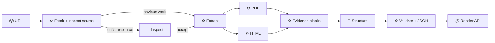

# URL2JSON backend

[← Back to README](../README.md)

The backend takes a public URL and turns it into `paper.document.v1` for the reader. Tools fetch, identify formats, spot obvious reading surfaces, and pull exact text. AI handles only unclear sources and arranges text.

> **Core rule:** AI can choose and arrange blocks. It cannot write the source text.

`🧠` intelligence · `⚙️` deterministic · `📦` interface

- **URL** — Get a public URL from the reader. *Example: a Tolstoy PDF or a Gutenberg HTML page.*
- **Fetch + inspect source** — Safely fetch the URL, identify its format, and make obvious calls. *Example: accept a full book page; reject an image or ZIP.*
- **Inspect unclear sources** — Decide the close calls. *Example: distinguish a paper abstract from the full paper.*
- **Extract** — Pull out the exact text and details. *Example: page text from a PDF or paragraphs from HTML.*
- **PDF / HTML** — Read PDFs and HTML pages. *Example: PyMuPDF for PDF; an HTML parser for Gutenberg.*
- **Evidence blocks** — Keep each piece of text with where it came from. *Example: “Chapter 1” from PDF page 3.*
- **Structure** — Put the pieces in the right order. *Example: heading first, then its paragraphs.*
- **Validate + JSON** — Check everything and make reader JSON. *Example: every displayed block points to real source text.*
- **Reader API** — Send the result to the app. *Example: `/api/read?url=...` returns the document.*

### Implementation

- [x] Define the shared `paper.document.v1` format.
- [x] Build `Fetch + identify format`: safely fetch public PDF/HTML sources and reject unsupported responses.
- [x] Extend `Fetch + inspect source`: auto-accept an obvious reading surface (for example, a long, low-link-density book body); reject unsupported or textless sources; send only unclear sources to AI.
- [x] Build `Inspect unclear sources`: use one DeepSeek call on the complete meaningful source DOM. The model can return only a verdict and supplied source-block IDs.
- [x] Keep the current PDF extractor working behind the new flow.
- [x] Add HTML extraction for readable pages and books.
- [x] Turn extracted text into evidence blocks with source locations.
- [x] Add the structure agent to arrange blocks using references only.
- [x] Validate the references and return `paper.document.v1`.
- [x] Connect `/api/read` and the frontend to the new response.
- [x] Add tests for PDFs, HTML, unreadable pages, and bad URLs.
- [x] Add chunking and background jobs for very long sources.

### Backlog

- [ ] Reduce DeepSeek context use. Keep all source text; 27/27 is the baseline.

### Readability regression cases

- Reject the Project Gutenberg [Reading Lists](https://www.gutenberg.org/ebooks/bookshelf/) catalog: it passes a technical HTML check but is not one coherent work.
- Accept Paul Graham’s [“What You Can’t Say”](https://www.paulgraham.com/say.html) essay: its old-style markup has no `article`, `main`, `p`, or `section`, despite containing the full work.
