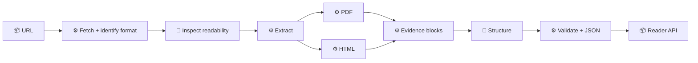

# URL2JSON backend

[← Back to README](../README.md)

The backend takes a public URL and turns it into `paper.document.v1` for the reader. Tools fetch, identify formats, and pull exact text. AI decides whether a source is a readable work and how to arrange its text.

> **Core rule:** AI can choose and arrange blocks. It cannot write the source text.

`🧠` intelligence · `⚙️` deterministic · `📦` interface

- **URL** — Get a public URL from the reader. *Example: a Tolstoy PDF or a Gutenberg HTML page.*
- **Fetch + identify format** — Safely fetch the URL and identify its format. *Example: accept a PDF or HTML page; reject an image or ZIP.*
- **Inspect readability** — Decide whether the source is a work worth reading. *Example: accept a book page; reject a catalog or login page.*
- **Extract** — Pull out the exact text and details. *Example: page text from a PDF or paragraphs from HTML.*
- **PDF / HTML** — Read PDFs and HTML pages. *Example: PyMuPDF for PDF; an HTML parser for Gutenberg.*
- **Evidence blocks** — Keep each piece of text with where it came from. *Example: “Chapter 1” from PDF page 3.*
- **Structure** — Put the pieces in the right order. *Example: heading first, then its paragraphs.*
- **Validate + JSON** — Check everything and make reader JSON. *Example: every displayed block points to real source text.*
- **Reader API** — Send the result to the app. *Example: `/api/read?url=...` returns the document.*

### Implementation

- [x] Define the shared `paper.document.v1` format.
- [x] Build `Fetch + identify format`: safely fetch public PDF/HTML sources and reject unsupported responses.
- [ ] Build `Inspect readability`: use the source-derived signals to decide whether a page is a readable work or should be rejected.
- [ ] Keep the current PDF extractor working behind the new flow.
- [ ] Add HTML extraction for readable pages and books.
- [ ] Turn extracted text into evidence blocks with source locations.
- [ ] Add the structure agent to arrange blocks using references only.
- [ ] Validate the references and return `paper.document.v1`.
- [ ] Connect `/api/read` and the frontend to the new response.
- [ ] Add tests for PDFs, HTML, unreadable pages, and bad URLs.
- [ ] Add chunking and background jobs for very long sources.

### Readability regression cases

- Reject the Project Gutenberg [Reading Lists](https://www.gutenberg.org/ebooks/bookshelf/) catalog: it passes a technical HTML check but is not one coherent work.
- Accept Paul Graham’s [“What You Can’t Say”](https://www.paulgraham.com/say.html) essay: its old-style markup has no `article`, `main`, `p`, or `section`, despite containing the full work.
